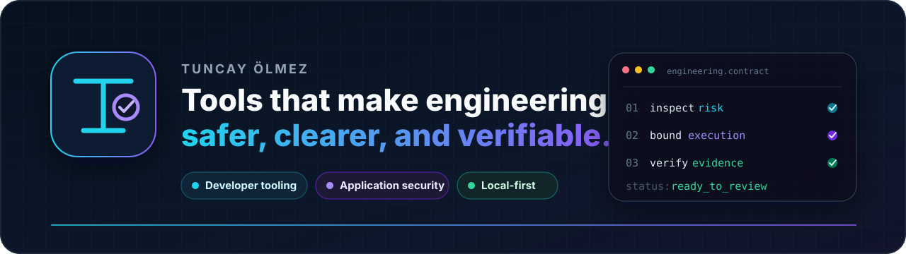
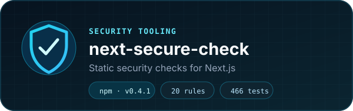
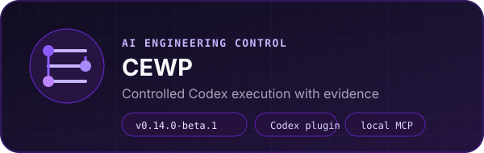
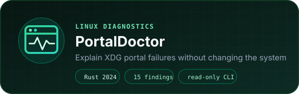
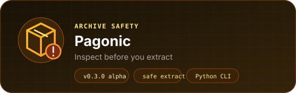

  

  
  
  

  I build tools that turn vague engineering risk into evidence you can inspect: 
  deterministic findings, bounded workflows, and read-only diagnostics.

## What I build

<table>
  <tr>
    <td width="33%" valign="top">
      <strong>Detect risk early</strong>  
      Static security analysis, SARIF reporting, archive inspection, and safe-extraction gates before deployment or file writes.
    </td>
    <td width="33%" valign="top">
      <strong>Control complex execution</strong>  
      Explicit scope, isolated worktrees, bounded operations, deterministic verification, recovery, and independent review.
    </td>
    <td width="33%" valign="top">
      <strong>Keep the evidence local</strong>  
      Rust, Python, TypeScript, SQLite, and system diagnostics designed to work without unnecessary cloud dependencies.
    </td>
  </tr>
</table>

## Featured projects

<table>
  <tr>
    <td width="50%" valign="top">
      
        
      Catches common Next.js security mistakes before deployment without executing the target repository or calling an LLM at scan time. Produces deterministic findings for local review, CI, and SARIF-compatible code scanning.
        
      <strong>Current:</strong> <code>v0.4.1</code> on npm · <code>20 rules</code> · <code>466 tests</code> 
      <code>TypeScript</code> <code>AST-assisted</code> <code>SARIF 2.1.0</code>
        
      <a href="https://github.com/SetraTheXX/next-secure-check"><strong>View repository →</strong></a>
    </td>
    <td width="50%" valign="top">
      
        
      Adds an engineering control plane around Codex: approved scope, isolated execution, operation budgets, verification outside the model loop, independent review, recovery, and portable evidence receipts.
        
      <strong>Current:</strong> <code>v0.14.0-beta.1</code> · npm beta 
      <code>Node.js 22+</code> <code>Codex plugin</code> <code>local MCP</code>
        
      <a href="https://github.com/SetraTheXX/Codex-Engineering-Workflow-Pack"><strong>View repository →</strong></a>
    </td>
  </tr>
  <tr>
    <td width="50%" valign="top">
      
        
      Reconstructs XDG portal routing and checks D-Bus and systemd reachability so Linux desktop-integration failures become actionable findings. Read-only by design, with no telemetry or runtime AI.
        
      <strong>Status:</strong> <code>v0.1.0 release-preparation baseline</code> · not tagged 
      <code>Rust 2024</code> <code>terminal + JSON</code> <code>read-only</code> <code>15 findings</code>
        
      <a href="https://github.com/SetraTheXX/Portal-Doctor"><strong>View repository →</strong></a>
    </td>
    <td width="50%" valign="top">
      
        
      Inspects ZIP archives for path traversal, suspicious entries, extreme compression ratios, unsupported methods, and structural errors before extraction. Available as a Python library and CLI from a local checkout.
        
      <strong>Current:</strong> <code>v0.3.0 alpha</code> · local installation · no PyPI release yet 
      <code>Python</code> <code>CLI</code> <code>safe extraction</code> <code>JSON + Markdown</code>
        
      <a href="https://github.com/SetraTheXX/pagonic"><strong>View repository →</strong></a>
    </td>
  </tr>
</table>

## Open-source contribution

<table>
  <tr>
    <td valign="top">
      
        
      <strong>MCP/OAuth security checks for Ship Safe</strong> 
      Contributed four conservative detections covering upstream token passthrough, audience validation, dynamic client registration, and PKCE handling. The work was merged after maintainer review, false-positive hardening, regression testing, and multi-language validation.
        
      <a href="https://github.com/asamassekou10/ship-safe/pull/161"><strong>Read the merged pull request →</strong></a>
    </td>
  </tr>
</table>

## More work

| Project | What it explores | Current state |
| --- | --- | --- |
| **[BioVoid](https://github.com/SetraTheXX/BioVoid)** | Reproducible protein-structure preparation and geometry-based pocket-candidate analysis through a local FastAPI/React application. | `v0.1.0 public source baseline` |
| **[Nihongo Learn](https://github.com/SetraTheXX/nihongo-learn)** | Japanese learning for Turkish-speaking beginners: kana, SM-2 reviews, 31 lessons, mini stories, and N5-style practice. | `usable local MVP` |

> **Scientific boundary:** BioVoid is a research prototype. It is not a clinical, diagnostic, validated binding-prediction, or drug-development system.

## Toolbox

  
  
  
  
  

  
  
  
  
  

  
  
  
  

  <strong>Currently exploring:</strong> Godot/C#, Three.js, Tauri, game systems, and lower-level software architecture.

## About me

I am a Computer Programming student at Ondokuz Mayıs University in Samsun,
Türkiye. Most of my projects begin as something I want to understand or use,
then move beyond the demo stage through tests, documentation, CI, explicit
limitations, and reproducible verification.

AI-assisted tools are part of my planning and implementation workflow, but they
do not get the final say. Runtime behavior, automated checks, manual review, and
honest evidence remain the release gates.

  <a href="https://linkedin.com/in/tuncayolmez"><strong>LinkedIn</strong></a>
  &nbsp;·&nbsp;
  <a href="https://www.npmjs.com/~setrathex"><strong>npm</strong></a>
  &nbsp;·&nbsp;
  <a href="mailto:tuncay123454@gmail.com"><strong>Email</strong></a>

